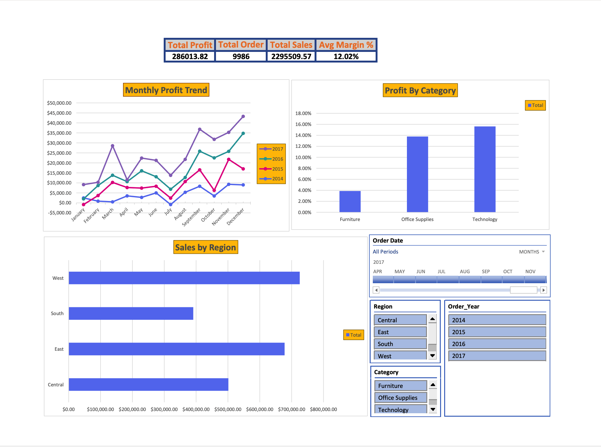

# Excel Sales Performance & Profitability Dashboard

## Project Overview
This project analyzes sales performance, profitability, and business risks using Excel.

## Key Features
- KPI Cards: Total Sales, Total Profit, Average Margin %, Total Orders
- Interactive dashboard with slicers (Region, Category, Year, Date)
- Profitability and seasonal trend analysis
- Identification of loss-making categories and regions

## Tools Used
- Microsoft Excel (Advanced)
- Pivot Tables & Pivot Charts
- SUMIFS, COUNTIFS
- Conditional Formatting
- Dashboard Design

## Business Insights
- High sales do not always translate to high profit
- Furniture category shows weak profitability despite strong revenue
- West region performs best across sales and margins

## Preview

